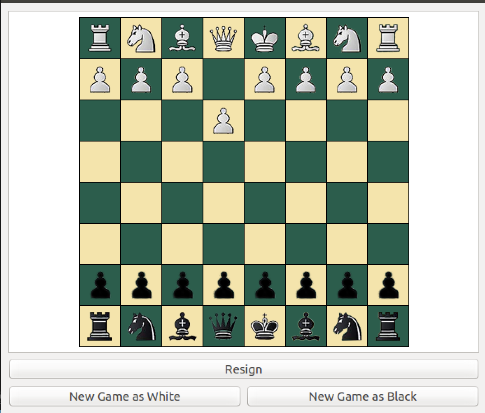

 
# QtChess

Created by [Colby Haskell](https://github.com/colbychaskell)

QtChess is a simple single-player chess game written in C++ with a Qt Gui. You
can play as white or black against an intelligent CPU opponent.

## Building and Running the Game:

1. Clone the repo
2. Create a build directory: `mkdir build`
3. Change to that directory `cd build`
4. Generate build files `cmake ../`
5. Build the project `cmake --build .`
6. Run the generated executable (.exe or .app)

## GUI

## Release Notes

### Prerelease v1.0.0-rc1:
- Added CMake Build System
- Added Github Actions
- Fixed code style and formatting issues
